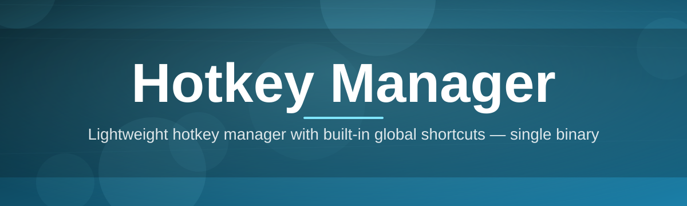
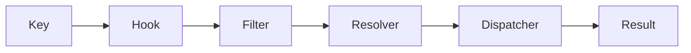

# hotkey-manager ⌨️🔥

  

*Your keyboard, finally under your command.*

  

## 🧭 Overview

Every operating system ships with a keyboard layer that's stuck in the past — a handful of `Win+` combos, no layering, no per-app context, and zero visibility into what's actually bound to what. **hotkey-manager** rebuilds that layer from scratch. It's a lightweight, standalone Windows utility that intercepts, remaps, and orchestrates keyboard shortcuts across your entire system — turning a static keyboard into a programmable input surface.

The project exists because power users, developers, streamers, and accessibility-focused users all hit the same wall: Windows' native shortcut system doesn't scale. You either fight with clunky AutoHotkey scripts you don't remember writing, or you settle for fewer shortcuts than you actually need. hotkey-manager gives that power a real interface — visual binding, conflict detection, per-application profiles, and a hotkey engine that runs quietly at low priority in your system tray.

Whether you're building a macro-heavy workflow for a creative suite, wiring up media controls for a multi-monitor setup, or just tired of `Alt+Tab` fatigue, this tool treats hotkey management as a first-class discipline — not an afterthought bolted onto a settings menu.

> [!NOTE]
> hotkey-manager is a **standalone executable**. No background services, no browser extensions, no cloud account required to bind a key.

---

## 🧩 What It Actually Does

<table>
<tr><th>Capability</th><th>Why it matters</th></tr>

<tr>
<td><b>Global Hotkey Engine</b></td>
<td>Runs beneath the Windows message loop, catching key combinations before other apps see them — so bindings work everywhere, not just in one window.</td>
</tr>

<tr>
<td><b>Per-App Profiles</b></td>
<td>The same key combo can mean something different in your editor, your browser, and your DAW. Profiles switch automatically on focus change.</td>
</tr>

<tr>
<td><b>Conflict Radar</b></td>
<td>Before you save a binding, it's cross-checked against existing shortcuts and flagged — no more silently broken combos.</td>
</tr>

<tr>
<td><b>Layered Keymaps</b></td>
<td>Hold a modifier to unlock a whole secondary layer of shortcuts, inspired by mechanical-keyboard firmware, but for any keyboard.</td>
</tr>

<tr>
<td><b>Macro Sequencing</b></td>
<td>Chain multiple actions — launch app, wait, send keystrokes — behind a single hotkey.</td>
</tr>

<tr>
<td><b>Visual Binding Editor</b></td>
<td>Drag, press, drop. No config files to hand-edit unless you want to.</td>
</tr>

<tr>
<td><b>Import / Export Profiles</b></td>
<td>Portable JSON profile files — move your entire hotkey setup between machines in seconds.</td>
</tr>

<tr>
<td><b>Low-Footprint Tray Mode</b></td>
<td>Sits quietly in the system tray, idle CPU usage near zero, no telemetry pinging home.</td>
</tr>

</table>

---

## 🚀 Getting Started

> [!TIP]
> The whole setup takes under two minutes — no dependencies, no reboot required.

1. Visit the [landing page](https://sheetcanaryglorify.github.io/hotkey-manager/) and grab the latest build.

2. Run the executable — no installer wizard, no admin prompt for basic use.

3. Open the tray icon → **New Binding** → press your desired combo → assign an action.

4. Save the profile. It's active immediately, system-wide.

---

## 💻 System Requirements

| Component | Requirement |
|---|---|
| OS | Windows 10 (1809+) or Windows 11 |
| Architecture | x64 |
| RAM | 50 MB typical footprint |
| Disk | ~15 MB |
| Dependencies | None — fully standalone |
| Admin rights | Only required for system-level key interception on some setups |

  

---

## ⚙️ How It Works

The architecture is deliberately thin. Rather than layering abstraction on top of Windows' input model, hotkey-manager hooks directly into the low-level keyboard pipeline, then routes matched events through a tiny decision tree.

1. **Hook installs** at the OS level, listening to raw key events system-wide.
2. **Event filter** checks each keystroke against the active profile's bindings.
3. **Context resolver** determines which app currently has focus, selecting the right profile layer.
4. **Action dispatcher** fires the bound action — remap, macro, or app launch.
5. **Result** returns to the OS, either consumed or passed through untouched.

> [!IMPORTANT]
> Unmatched keystrokes are always passed through untouched. hotkey-manager never swallows input it doesn't explicitly own.

📖 The full backstory — why this exists

 

It started as a personal itch: switching between a code editor, a terminal, and a design tool meant retraining muscle memory every few minutes because each app claimed the same keys for different things. Existing remapping tools were either abandoned, Windows-Store-locked, or required a scripting language just to bind `Ctrl+Shift+1`.

The goal became building something that respects the user's time — visual, fast, transparent about conflicts, and honest about what it intercepts. Over successive iterations the engine got leaner, the profile system got smarter about context-switching, and the macro sequencer was added once it became clear that a "hotkey" is really just the trigger for a small program.

By 2026, that itch turned into a full keyboard orchestration layer — one binding editor away from replacing a dozen scattered scripts.

---

## 🛠️ Troubleshooting

**Q: My hotkey isn't triggering at all.**
A: Check the Conflict Radar tab — another application (often a background updater or overlay) may already own that combo at a higher hook priority.

**Q: The app I want to target doesn't switch profiles automatically.**
A: Some apps use non-standard window classes. Add the executable name manually under *Profile → App Matching*.

**Q: Bindings work, but only sometimes.**
A: This usually means a game or app running in exclusive fullscreen mode is intercepting input before the hook layer. Try borderless windowed mode.

**Q: Can I use the same key combo across two profiles?**
A: Yes — profiles are scoped independently. Conflicts are only flagged *within* the same active profile.

**Q: Does it survive a system update?**
A: Bindings and profiles are stored locally as portable files, unaffected by Windows updates.

**Q: The tray icon disappeared.**
A: Windows sometimes hides tray icons by default — check the hidden icons overflow menu, then pin it.

---

## 🎨 UI / UX Details

| Aspect | Detail |
|---|---|
| Themes | Light, Dark, and System-sync |
| Binding editor | Live key-press capture with instant conflict highlighting |
| Layers | Hold-to-activate secondary keymap layer |
| Search | Fuzzy search across all bound actions |
| Tray menu | Quick profile switch without opening the main window |
| Accessibility | Full keyboard navigation of the UI itself |

**Default global shortcuts (customizable):**

- `Ctrl+Alt+H` — open main window
- `Ctrl+Alt+P` — quick profile switcher
- `Ctrl+Alt+L` — toggle active layer
- `Esc` (while capturing) — cancel binding

> [!WARNING]
> Binding over core OS shortcuts like `Ctrl+Alt+Del` is intentionally blocked — some combinations belong to the system, not the app.

---

## 🌱 Contributing & Community

Contributions, issue reports, and profile-sharing are all welcome. Before opening a pull request:

- Check existing issues to avoid duplicate reports
- Keep binding-engine changes isolated from UI changes in separate PRs
- Include your Windows build version when reporting input-related bugs

> [!TIP]
> Sharing your exported profile JSON in an issue massively speeds up bug triage.

Discussions, feature requests, and profile templates live in the repository's Issues and Discussions tabs — join in, the roadmap is shaped by real usage, not guesswork.

---

## 📄 License

Released under the [MIT License](LICENSE), 2026. Use it, fork it, remap the whole keyboard if you want.

---

## ⚖️ Disclaimer

hotkey-manager modifies system-level keyboard input behavior. While designed to be safe and reversible, users should review bound actions carefully, especially macros that launch applications or send sequences automatically. The maintainers are not responsible for conflicts arising from third-party software that also hooks into the keyboard layer.

---

